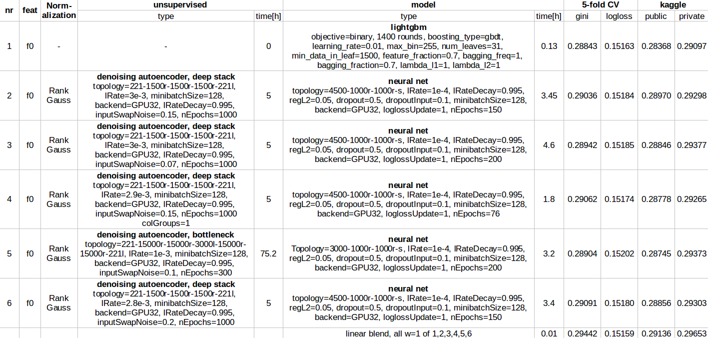

# Porto Seguro’s Safe Driver Prediction

[Kaggle比赛：Porto Seguro的安全驾驶预测](https://www.kaggle.com/c/porto-seguro-safe-driver-prediction) 代码

## [1st place](https://www.kaggle.com/c/porto-seguro-safe-driver-prediction/discussion/44629)

6个模型做融合（1x lightgbm, 5x nn）.

### feature engineering

作者做的比较少
> 1.Basically I removed *calc, added 1-hot to *cat features. Thats all I've done. No missing value replacement or something. This is featureset "f0" in the table. 
> 
> 2.Thanks to the public kernels (wheel of fortune eg.) that suggest to remove *calc features, I'm too blind and probably would not have figured this out by myself
> 

### local validation

cv,模型结果做均值
>1.5-fold CV as usual. Fixed seed. No stratification. 
>
>2.averages of all fold models. Just standard as I would use for any other task. 
>
>3.Somebody wrote about bagging and its improvements, I spend a week in re-training all my models in a 32-bag setup (sampling with replacement). Score only improved a little.

### normalization

归一化的时候用了RankGauss
>1.Input normalization for gradient-based models such as neural nets is critical.For lightgbm/xgb it does not matter.
>

### unsupervised learning

用无监督模型DAE构造特征，这个阶段往往把特征扩展到1K~10K的数量级
>1.The larger the testset, the better
>
>2.A denoising autoencoder tries to reconstruct the noisy version of the features. It tries to find some representation of the data to better reconstruct the clean one. 
>

### learning with train+test features unsupervised
略

### other unsupervised models

尝试使用GAN，失败了;开了一个脑洞，没有尝试。
>1.I think they have a fundamental problem in generating both numeric and categoric data.At the end they were low 0.28x on CV, too low to contribute to the blend. Havent tried hard enough.
>
>2.Another idea that come late in my mind was a min/max. game like in GAN to generate good noise samples. Its critical to generate good noise for a DAE. I'm thinking of a generator with feature+noiseVec as input, it maximizes the distance to original sample while the autoencoder (input from generator) tried to reconstruct the sample... more maybe in another competition.

###neural nets

> 1.Hidden layers have 'r' = relu activation
> 
> 2.Trained to minimize logloss
> 
> 3.Input dropout often improve generalization when training on DAE features. 
> 

###lightgbm

>I tuned params on CV.

###blending
Nonlinear things failed.
>For me even tuning of linear blending weights failed. So I stick with all w=1.

###what did not work

upsampling, deeper autoencoders, wider autoencoders, KNNs, KNN on DAE features, nonlinear stacking, some feature engineering (yes, I tried this too), PCA, bagging, factor models (but others had success with it), xgboost (other did well with that) and much much more..